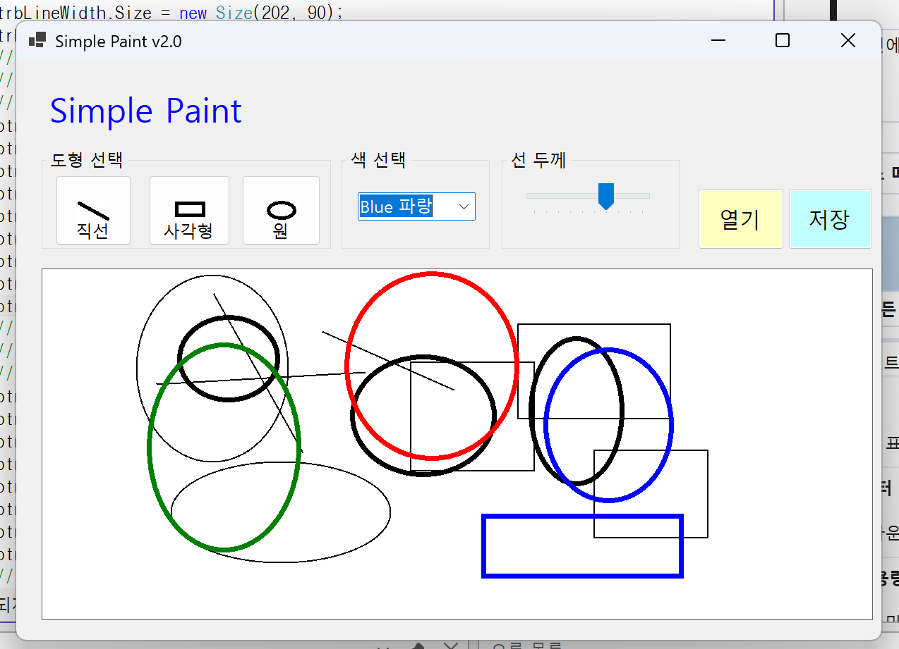
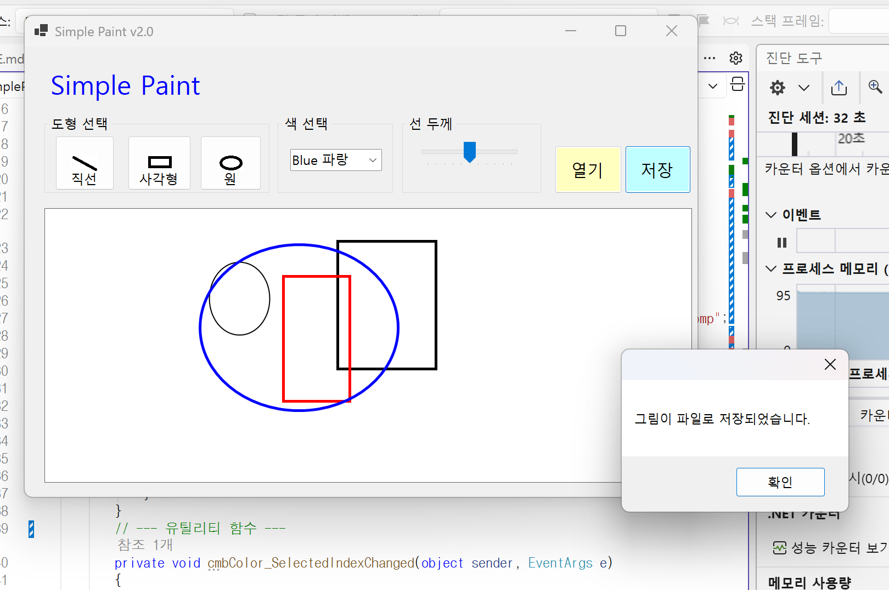
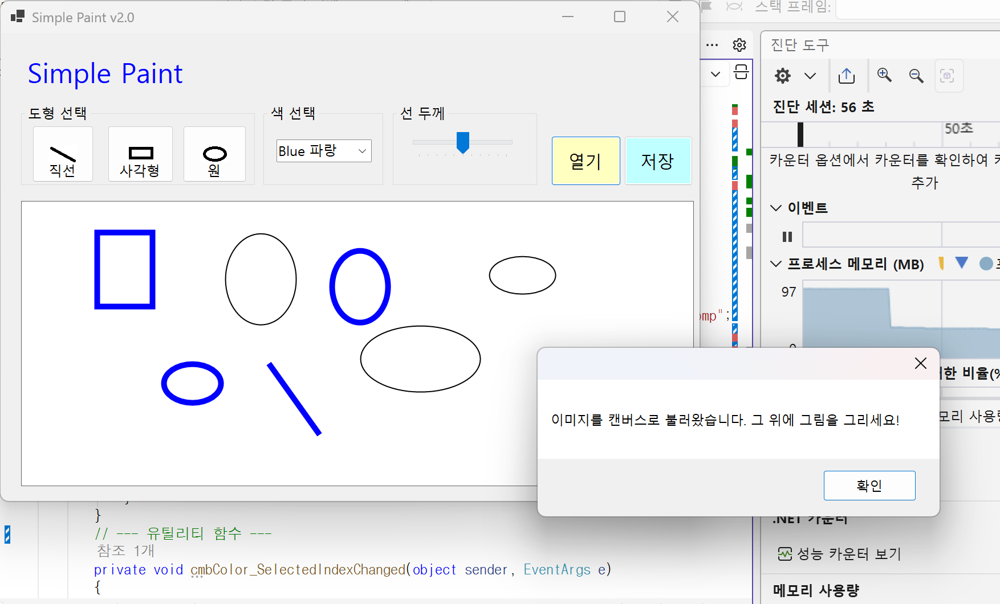

# (c#코딩) 그림판앱

## 개요
- c# 프로그래밍 학습
- 1줄 소개: 직선, 사각형, 원을 그릴 수 있는 그림판 프로그램

- 사용한 플랫폼:
  - c#, .NET Windows Forms, Visual Studio, GitHub

- 사용한 컨트롤:
  - Label, ComboBox, TrackBar, Button, GroupBox, PictureBox

- 사용한 기술과 구현한 기능:
  - visual studio를 이용하여 UI 디자인
　- 마우스 이벤트를 활용한 도형그리기
  - 도형 선택, 색상 선택, 선 굵기 선택 기능 구현

## 실행 화면 (과제1)
- 코드의 실행 스크린샷과 구현 내용 설명

- 구현한 내용:
기본적인 GUI 구성과 사용자 인터랙션을 위한 선택 기능을 중점적으로 구현하였습니다. 우선 다양한 컨트롤을 화면에 적절히 배치하고 각각의 컨트롤에 고유한 이름을 부여하여 속성을 설정하였습니다.
주요 기능으로는 사용자가 원하는 결과물을 도출할 수 있도록 도형 선택, 색상 선택, 그리고 선 굵기 선택 기능을 완성하였습니다. 각 컨트롤이 제공하는 기본 동작을 확인하고, 사용자의 선택 값이 시스템에 정확히 반영되도록 이벤트 로직을 설계하여 UI와 기능 간의 안정적인 연동을 구현했습니다.

## 실행 화면 (과제2)
- 코드의 실행 스크린샷과 구현 내용 설명

- 구현한 내용:
마우스 드래그 이용한 그림그리기 기능을 구현하였습니다. 마우스 이벤트를 활용하여 사용자가 마우스를 클릭하고 드래그하는 동안 도형이 실시간으로 그려지도록 하였습니다. 이를 위해 MouseDown, MouseMove, MouseUp 이벤트를 처리하여 도형의 시작점과 끝점을 추적하고, 선택된 도형 유형에 따라 적절한 도형을 그리는 로직을 구현하였습니다. 또한, 사용자가 선택한 색상과 선 굵기를 적용하여 도형이 원하는 스타일로 그려지도록 하였습니다.이를 통해 직선 , 사각형, 원을 자유롭게 그릴 수 있는 기능을 완성하였습니다.
또한 이전 과제에서 구현한 도형 선택, 색상 선택, 선 굵기 선택 기능과 연동하여 사용자가 원하는 스타일로 도형을 그릴 수 있도록 하였습니다. 이를 통해 사용자 인터랙션과 도형 그리기 기능이 원활하게 통합된 그림판 프로그램을 완성하였습니다.

## 실행 화면 (과제3)
- 코드의 실행 스크린샷과 구현 내용 설명

- 구현한 내용:  
이번 과제에서는 캔버스에 그려진 결과물을 물리적인 파일로 보관할 수 있는 이미지 저장 기능을 구현하였습니다. 우선 사용자가 저장 경로와 파일 이름을 직접 지정할 수 있도록 SaveFileDialog 대화상자를 활용하여 직관적인 인터페이스를 제공하였습니다.
특히 메모리 상에 존재하는 canvasBitmap 객체의 데이터를 활용하여 사용자의 요구에 따라 .png, .jpg, .bmp의 세 가지 주요 포맷으로 저장할 수 있도록 기능을 세분화하였습니다. 각 확장자에 맞는 이미지 포맷을 로직 내에서 자동으로 판별하여 저장함으로써, 작업한 결과물을 다양한 환경에서 활용할 수 있는 데이터 무결성을 확보하였습니다.

## 실행 화면 (과제4)
- 코드의 실행 스크린샷과 구현 내용 설명

- 구현한 내용:  
외부 이미지 파일을 불러와 이를 배경 캔버스로 활용하는 기능을 구현하였습니다. OpenFileDialog로 이미지를 읽어 들인 뒤, 해당 이미지의 해상도에 맞춰 캔버스와 PictureBox의 크기를 동적으로 조정하도록 설계했습니다. 이미지가 화면보다 클 경우를 대비해 스크롤바 기능을 활성화하여 작업의 편의성을 높였으며, 불러온 외부 이미지 위에 기존의 도형 그리기 도구를 사용하여 추가적인 그래픽 작업을 수행하고 이를 다시 통합하여 저장할 수 있습니다.