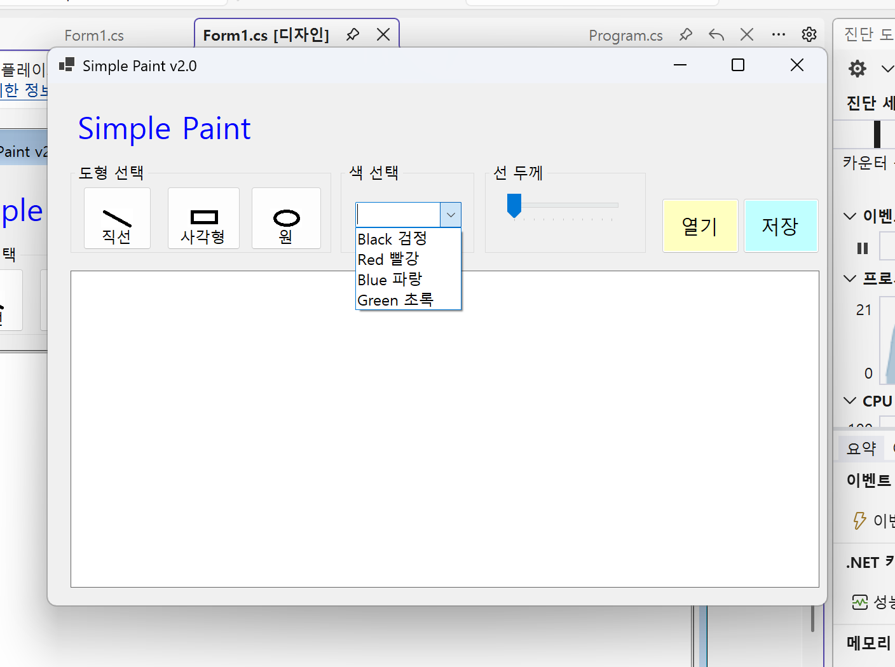
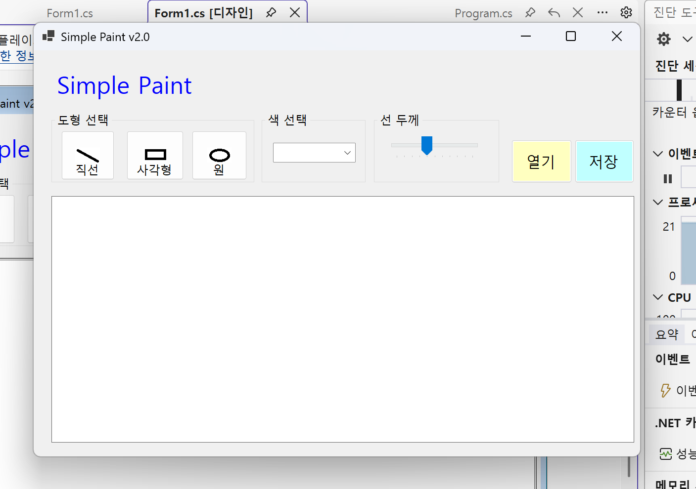

# (c#코딩) 그림판앱

## 개요
- c# 프로그래밍 학습
- 1줄 소개: 직선, 사각형, 원을 그릴 수 있는 그림판 프로그램

- 사용한 플랫폼:
  - c#, .NET Windows Forms, Visual Studio, GitHub

- 사용한 컨트롤:
  - Label, ComboBox, TrackBar, Button, GroupBox, PictureBox

- 사용한 기술과 구현한 기능:
  - visual studio를 이용하여 UI 디자인
　- 마우스 이벤트를 활용한 도형　그리기

## 실행 화면 (과제1)
- 코드의 실행 스크린샷과 구현 내용 설명

- 구현한 내용
기본적인 GUI 구성과 사용자 인터랙션을 위한 선택 기능을 중점적으로 구현하였습니다. 우선 다양한 컨트롤을 화면에 적절히 배치하고 각각의 컨트롤에 고유한 이름을 부여하여 속성을 설정하였습니다.
주요 기능으로는 사용자가 원하는 결과물을 도출할 수 있도록 도형 선택, 색상 선택, 그리고 선 굵기 선택 기능을 완성하였습니다. 각 컨트롤이 제공하는 기본 동작을 확인하고, 사용자의 선택 값이 시스템에 정확히 반영되도록 이벤트 로직을 설계하여 UI와 기능 간의 안정적인 연동을 구현했습니다.